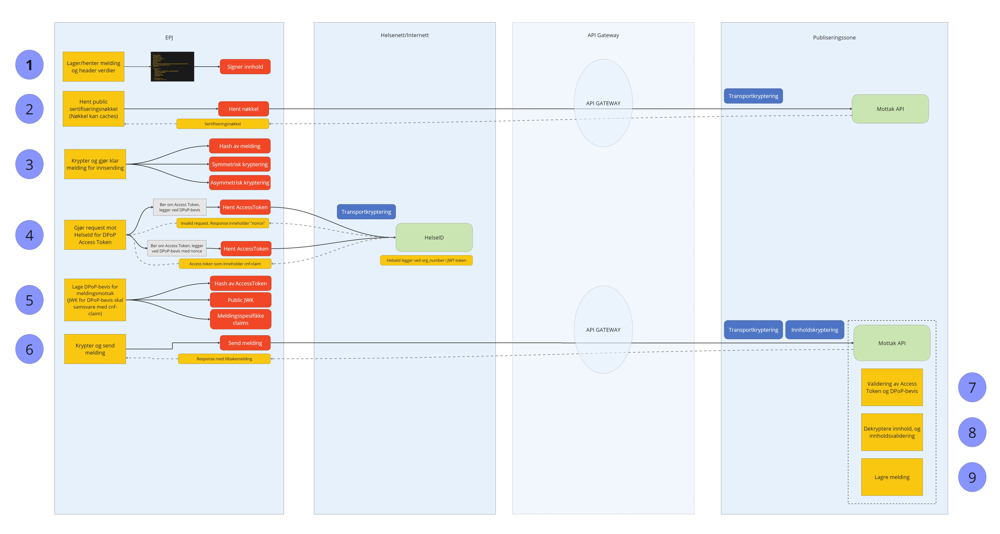

<!--
  To generate a PDF from this markdown file, use the extension "Markdown PDF" in Visual Studio Code.
  You may change the header and footer template in the settings of the extension.

  Current settings (Add these to settings.json directly):
  "markdown-pdf.headerTemplate": "<div></div>",
  "markdown-pdf.footerTemplate": "<div style=\"font-size: 9px; margin-left: auto; margin-right: 1cm; \"><span class='pageNumber'></span> / <span class='totalPages'></span></div>",
-->
<p align="right">
    
</p>

# SLASH - API Mottak

Dette dokumentet tar for seg SLASH API-løsningen for å overføre helsedata til registeret.

Det er mulig å laste ned en fullstendig demoløsning for innsending.<br>
Se [Eksempelkode](#eksempelkode) for mer informasjon.

<br>

## Innhold

- [Om tjenesten](#om-tjenesten)
- [Overordnet flyt](#overordnet-flyt)
- [Autentisering](#autentisering)
- [API metoder](#api-metoder)
- [Overføring av helsedata](#overføring-av-helsedata)
- [Miljøer](#miljøer)
- [Eksempelkode](#eksempelkode)
- [Referanser](#referanser)

<div style="page-break-after: always"></div>

## Om tjenesten

Tjenesten er et REST-basert API designet for sikker overføring av helsedata. API-et tilbyr en moderne og effektiv løsning for avlevering av meldinger via HTTP, som et alternativ til tradisjonelle EDI-baserte løsninger.

Meldinger sendes i JSON-format og må krypteres, signeres, og autentiseres ved bruk av HelseID. Ved mottak validerer tjenesten autentisering, signatur, header-verdier og meldingsstruktur i en sekvensiell prosess. Dette sikrer at avsender umiddelbart får tilbakemelding om hvorvidt meldingen er teknisk godkjent og korrekt mottatt.

### Krav

Tjenesten benytter HelseID til autentisering. Det stilles derfor krav til at en hver innsender har en oppføring i HelseID for den lokasjonen som skal sende inn data gjennom denne tjenesten. (HelseID-klienten bør utstedes på bedriftsnummeret til den faktiske lokasjonen)

I tillegg til dette kan det være nødvendig å opprette nettverksåpninger mot API-tjenesten til FHI på NHN og helsenettet.

<div style="page-break-after: always"></div>

## Overordnet flyt


_Overordnet skisse på hvordan helsedata skal overføres med API-tjenesten_

#### Forklaring

1. EPJ genererer og formaterer et skjematisk strukturert JSON-objekt i henhold til den meldingstypen som skal avleveres.
   - Her lages også tilhørende header-verdier som må være en del av avleveringen.
2. Henter "Public Key" fra API-tjenesten som skal benyttes i kryptering.
   - Nøkkelen vil brukes i et hybrid krypteringssystem. Se [Referanser](#referanser) for mer informasjon.
3. Gjør klar meldingen for innsending
   1. Lag en hash av meldingen
   2. Symmetrisk kryptering av meldingen
   3. Asymmetriske kryptering av nøkkelen med "Public Key" fra API-tjenesten
4. Access Token
   1. Lag et DPoP-bevis og gjør første forespørsel til HelseID for å få et Access Token
   2. Respons fra HelseID vil inneholde en "nonce"-verdi som skal brukes i neste steg
   3. Lag et nytt DPoP-bevis og gjør en ny forespørsel til HelseID for å få et Access Token
   4. Respons fra HelseID vil inneholde et Access Token med "cnf"-claim som inneholder informasjon om nøkkelpar som ble brukt i DPoP-beviset
5. Lag DPoP-bevis mot API-tjenesten
   - Eksempel på DPoP-bevis kommer under avsnittet [Avlevering av meldinger](#avlevering-av-meldinger)
6. Send melding til API-tjenesten
   1. Legg ved DPoP-beviset i HTTP-headeren "DPoP"
   2. Legg ved Access Token fra HelseID i HTTP-headeren "Authorization"
      - Authorization Scheme: DPoP
   3. Legg ved kryptert melding i HTTP-body
   4. Legg til nødvendige header-verdier
      - Se avsnittet [Avlevering av meldinger](#avlevering-av-meldinger)
7. (API-tjenesten) Validering av Access Token og DPoP-bevis
8. (API-tjenesten) Dekryptering og innholdsvalidering
   1. Validere header-verdier
   2. Dekryptere meldingen og sjekke hash fra DPoP-beviset
   3. Validere meldingen mot meldingsskjema
9. (API-tjenesten) Lagring melding og send respons

Se [Referanser](#referanser) for mer informasjon om DPoP og HelseID.

<div style="page-break-after: always"></div>

## Autentisering

API-tjenesten benytter HelseID til autentisering/tilgangssikring (machine to machine).
Dette realiseres ved hjelp av OpenID Connect(OIDC). Alle forespørsler til API-et blir dermed kontrollert mot HelseID.

For HelseID så kan en enten benytte klientkonfig fra rapporterende enhet direkte eller benytte klientkonfig fra EPJ (multi-tenant) for å få utstedt token (JWT) med nødvendige claims/påstander. Hvis en benytter multi-tenant så må EPJ sitt orgnummer settes som claim "helseid://claims/client/claims/orgnr_supplier", mens rapporterende enhet settes som "helseid://claims/client/claims/orgnr_parent".
Utstedt token skal deretter benyttes i forespørsler mot API-et.

Les mer om HelseID og teknisk dokumentasjon her:
[https://www.nhn.no/helseid/](https://www.nhn.no/helseid/)

<div style="page-break-after: always"></div>

## API metoder

#### Swagger

API-tjenesten benytter Swagger for å dokumentere samtlige meldingstyper og versjoner.
Du finner Swagger-portalen ved å trykke på linken nedenfor:

[https://app-mottak-test.azurewebsites.net/swagger/index.html](https://app-mottak-test.azurewebsites.net/swagger/index.html)

Portalen viser endepunkter for API-et.

<div style="page-break-after: always"></div>

## Overføring av helsedata

Detaljert dokumentasjon på hvordan en skal overføre helsedata til API-tjenesten.

#### 1) Forbred meldingsinnhold og headerverdier

Meldinger skal sendes som JSON-format i HTTP-forspørsel (POST).
Sørg derfor for å strukturere meldingen i henhold til meldingsskjemaet for ønsket meldingstype.

##### Headerverdier

Følgende HTTP Header-verdier må legges til i forespørselen:

| Navn                      | Beskrivelse                                       | Påkrevd | Type              | Eksempel verdi       |
| ------------------------- | ------------------------------------------------- | ------- | ----------------- | -------------------- |
| x-vendor-name             | Navn på leverandør av software                    | Ja      | String            | _Softwarebedrift AS_ |
| x-software-name           | Navn på EPJ/programvare                           | Ja      | String            | _PasientJournal123_  |
| x-software-version        | Versjon på EPJ/Programvare                        | Ja      | String            | _1.0.4_              |
| x-export-software-version | Versjon på uttrekksmodul/-program                 | Ja      | String            | _3.0.9_              |
| x-data-extraction-date    | Dato for eksportering av data fra EPJ/programvare | Ja      | Date (dd.MM.yyyy) | _31.12.2023_         |

#### 2) Hent public key og hash & kryptere innhold

Uthenting av offentlig nøkkel, brukt til kryptering av symmetrisk nøkkel, gjøres med en HTTP-forespørsel mot API-tjenesten.

Endepunkt: `/keys`

Dette endepunktet returnerer en liste over gyldige nøkler. Bruk nøkkelen som har senest utløpsdato.
Nøkkelen kan caches og benyttes til kryptering av flere meldinger.

Eksempel på respons fra API:

```
[
    {
        "id": "47c24d37-6511-40a2-ab19-d2386d102900",
        "expirationDate": "9999-12-31T23:59:59.999",
        "publicKey": "-----BEGIN PUBLIC KEY-----\r\nMIIBojANBgkqhkiG9w0BAQEFAA ... -----END PUBLIC KEY-----"
    }
]
```

Verdien på `publicKey` skal benyttes ved kryptering av symmetrisk nøkkel. <br>
Verdien på `id` skal legges inn i DPoP-bevis mot API-tjenesten under claimet `enc_key_id`.

**Kryptering**

Fremgangsmåten for å kryptere innholdet er som følgende:

1. Lag en hash av meldingen
   - Hashen skal være en Base64-encoded SHA256 hash
1. Generer en symmetrisk nøkkel
   - Lengden på nøkkelen skal være 32 bytes eller mer
1. Krypter innholdet med den symmetriske nøkkelen.
1. Krypter den symmetriske nøkkelen med Public Key som tidligere ble hentet fra API-tjenesten.

Verdien for hash av melding skal legges inn i DPoP-bevis mot API-tjenesten under claimet `msh_hash`. <br>
Verdien for den krypterte symmetriske nøkkelen skal legges inn i DPoP-bevis mot API-tjenesten under claimet `enc_sym_key`.

#### 3) Hent Access Token fra HelseID

API-tjenesten benytter HelseID for autentisering og krever at et "Access Token" følger med forespørsel mot API-et.

Senere i prosessen skal det opprettes et DPoP-bevis som skal benyttes mot API-tjenesten.
Dette beviset vil inneholde en offentlig del av et nøkkelpar som innsender selv bestemmer.
Det er mulig å benytte nøkkelparet som ligger i HelseID-klientkonfigurasjonen, men man kan også benytte et eget nøkkelpar.

Uansett nøkkelpar som skal benyttes må dette paret "godkjennes" av HelseID.
Dette gjøres ved å lage et DPoP-bevis som er signert med ønsker nøkkelpar.
DPoP-beviset skal sendes sammen med en forespørsel til HelseID for å få et Access Token.

#### 3.1) Korrespondanse med HelseID

Lag et DPoP-bevis og legg dette i header-verdien "DPoP".

```json
{
  "alg": "RS256",
  "kid": "0-8E4RNYlw_aFRE-fVtclOLDgHtQB2KfzDIgTbE5X7g",
  "typ": "dpop+jwt",
  "jwk": {
    "kty": "RSA",
    "n": "nqI3e2qx30o08bw9mdW5CTxPaIyY3-UdYgF7Oa04P8wrEpcHIpWmPuYlNLLysWYEDPJa7SCRXL9X8pMHdF0t6b8Lago_Va4PFd0T8D6sWEmN3YH3KQNzxOQhqko3ojsQCGWhuM3zP47cfyk0PfoE4zYqUZZrYHiIgECbEjM0TRJCRrl6K7YEIWlnd5qVLFaXZiEEfITXAJrV6xaYHGducXzOlaqq89NsgmbGBUb4Kac8GU9tAuF6fdCUtLqfoTv0lsMnRoZHwTsSNrnrMjToRBdyDoQWIVydhTn5w61CMWnSksEXMShYDeTwTvrPOoKRncii6s2P3j9eEi9Okh6RbQ",
    "e": "AQAB",
    "alg": "RS256"
  }
}
.
{
  "jti": "3319f016-9760-413e-9529-06fd88de0093",
  "htm": "POST",
  "htu": "https://helseid-sts.test.nhn.no/connect/token",
  "iat": 1715356172
}
.
[Signature]
```

_Eksempel på decoded DPoP-bevis_

Lag en JWT med client assertion

```json
{
  "alg": "RS256",
  "typ": "JWT"
}
.
{
  "sub": "1185d326-422d-43e0-8c3c-4111d6fd4224",
  "iat": "1715356172",
  "jti": "00d0e27bc24947d6970a73fe1088863f",
  "nbf": 1715356172,
  "exp": 1715356232,
  "iss": "1185d326-422d-43e0-8c3c-4111d6fd4224",
  "aud": "https://helseid-sts.test.nhn.no/"
}
.
[Signature]
```

_Eksempel på decoded JWT_

Denne forespørselen skal sendes til HelseID sitt token-endepunkt.

Responsen på denne forespørselen vil feile, men inneholde en "nonce"-verdi som skal brukes i neste steg.

Lag så en ny JWT med client assertion og et nytt DPoP-bevis lik den første, men nå med claimet `nonce` med verdien fra første respons.

```json
{ ... }
.
{
  "jti": "22810a6a-2e31-41c2-a02c-7e0b20c80846",
  "htm": "POST",
  "htu": "https://helseid-sts.test.nhn.no/connect/token",
  "iat": 1715356808,
  "nonce": "CfDJ8GEx18wci25Io3ttUEmnMl5zGiV9JcByNBiwEKjwk9cKc0VQTfRRI19bIKyWL5AGEHuhLaCzejHU7I6x2IsM83fs--z5incMdwrfFDMWnt3TLRIZ-EYsgO0BtyEmcY3d3w"
}
.
[Signature]
```

Send forespørselen til HelseID sitt token-endepunkt.

Responsen vil nå inneholde et Access Token, som inneholder claimet `cnf` som beskriver nøkkelparet brukt i DPoP-bevisene.

Ved innsending til API-tjenesten skal Access Token benyttes som verdi for HTTP-headeren `Authorization` med syntaks `DPoP {accessToken}`.

#### 4) Send melding til API-tjenesten

Meldingen skal sendes som et HTTP POST-kall mot API-tjenesten. Det krypterte innholdet (payload) sendes i BASE64-format.
API-mottaket har følgende endepunkt: `/message`.

Lag et nytt DPoP-bevis for innsending til API-tjenesten

```json
{
  "alg": "RS256",
  "kid": "0-8E4RNYlw_aFRE-fVtclOLDgHtQB2KfzDIgTbE5X7g",
  "typ": "dpop+jwt",
  "jwk": {
    "kty": "RSA",
    "n": "nqI3e2qx30o08bw9mdW5CTxPaIyY3-UdYgF7Oa04P8wrEpcHIpWmPuYlNLLysWYEDPJa7SCRXL9X8pMHdF0t6b8Lago_Va4PFd0T8D6sWEmN3YH3KQNzxOQhqko3ojsQCGWhuM3zP47cfyk0PfoE4zYqUZZrYHiIgECbEjM0TRJCRrl6K7YEIWlnd5qVLFaXZiEEfITXAJrV6xaYHGducXzOlaqq89NsgmbGBUb4Kac8GU9tAuF6fdCUtLqfoTv0lsMnRoZHwTsSNrnrMjToRBdyDoQWIVydhTn5w61CMWnSksEXMShYDeTwTvrPOoKRncii6s2P3j9eEi9Okh6RbQ",
    "e": "AQAB",
    "alg": "RS256"
  }
}
.
{
  "jti": "5629c0cf-ef59-4058-b831-fbb573aad334",
  "htm": "POST",
  "htu": "https://app-mottak-test.azurewebsites.net/message",
  "iat": 1715426416,
  "msg_type": "HST_Konsultasjon",
  "msg_version": "1",
  "msg_hash": "XqOR1SZn1IchuHWWbWQ6rI1MWm4Bo0cmISenZZZLU1s",
  "enc_sym_key": "PTimgMeCZlKHik2kpkqrHa/RLoGwN7RDGm5Iee7VBKEygWxuzSNfQOUg7ybUHfjiVsv0uEEgiMtcXQeCZFlZfJtsad7ut9gZhHp699aPqR5J+Px5lgZJyyW1PPyE1uooyWcHMszxZV35WioRKDD0+cdUzZ0h6a8fiyJPxVhrcm/nhCHFBvkitbWaL2Ye0yiTc8t/H45RTjcZ9AOvW7awG8rtNPpOFF7nLZQ2BknliKvInLxRwCOBmBc2jfkaj2LiEW9+2gPzVEOTyRx6bKcRSXwLi7EUtwNT7NoqCs5RG2aG6eunZjg16i6HfZx8M4hg6I73yG9UI5oKcpRDEfFc9IsrDTBMnBGy0Cvjn6d0o8NqkRFNfsqbXWrVqhKKx9C62qTFRKvVbEXlzReUVK4YWMl/TOMQre6rBOjNqfOkoUEv51R8hpMNDbTJIxY0O55e3wtLIGRYNt4x0FzV3cmL2Dr314c2NNhI5zmR++Iy3+/r5lZWH0UkiYO+sORASw1U",
  "enc_key_id": "47c24d37-6511-40a2-ab19-d2386d102900",
  "ath": "_j4ZpplB6TBA-7EeIoHOnwqJf9XgItc1CXSti12ZD28"
}
.
[Signature]
```

_Eksempel på DPoP-bevis_

Bemerkninger:

- `typ` i header skal være `dpop+jwt`
- `jwk` i header skal korrespondere med cnf-claimet i Access Token
- `htm` i payload skal være HTTP-metoden som skal benyttes mot API-tjenesten
- `htu` i payload skal være URL-en til API-tjenesten for avlevering av meldinger
- `msg_type` i payload skal være meldingstypen som skal avleveres
- `msg_version` i payload skal være versjonen av meldingen som skal avleveres
- `msg_hash` i payload skal være hashen av meldingen før den ble kryptert
- `enc_sym_key` i payload skal være den krypterte symmetriske nøkkelen som ble brukt til å kryptere meldingen
- `enc_key_id` i payload skal være ID-en til offentlig nøkkel som ble brukt til å kryptere symmetrisk nøkkel
- `ath` i payload er hash av Access Token som blir brukt i forespørselen

Legg også til nødvendinge header-verdier som beskrevet i avsnittet [Forbred meldingsinnhold og headerverdier](#1-forbred-meldingsinnhold-og-headerverdier):

```
x-vendor-name: Softwarebedrift AS
x-software-name: PasientJournal123
x-software-version: 1.0.4
x-export-software-version: 3.0.9
x-data-extraction-date: 31.12.2023
```

#### 5 a) Innlevering godkjent

Dersom meldingen er godkjent vil responsen fra API-et ha responskode "HTTP 200 OK".<br>
Responesen vil inneha en `X-Correlation-ID` header med API-tjenestens interne id på forsendelsen.<br>
I tillegg vil en motta følgende respons i body:

```json
{
  "delivered": true,
  "errors": []
}
```

#### 5 b) Innlevering feilet

Dersom authentisering er ugyldig vil responsen fra API-et ha responskode "HTTP 401 Unauthorized".<br>
Dersom noe annet i forspørselen ikke validerer så vil responsen fra API-et ha responskode "HTTP 400 Bad Request".<br>
Responesen vil inneha en `X-Correlation-ID` header med API-tjenestens interne id på forsendelsen.<br>
I tillegg vil en motta ytterligere informasjon om hva som feilet i body. Eksempel:

```json
{
  "delivered": false,
  "errors": [
    {
      "errorCode": 2006,
      "propertyName": null,
      "errorMessage": "Error: SchemaValidationFailed | Schema validation failed",
      "errorDetails": "[{\"Location\":\"/0\",\"Errors\":[{\"Value\":\"Required properties [\\u0022orgNr\\u0022] are not present\"}]}]"
    }
  ]
}
```

**Oversikt over feilmeldinger**

| Feilkode | Feilmelding                                               | Beskrivelse                                                                 |
| -------- | --------------------------------------------------------- | --------------------------------------------------------------------------- |
| 1001     | HttpHeaderMissing                                         | Én eller flere manglende HTTP header-verdier                                |
| 1002     | HttpHeaderValidation                                      | Ugyldig verdi på én eller flere HTTP-headere                                |
| 1003     | InvalidMessageTypeVersion                                 | Ugyldig meldingstype og/eller meldingsversjon                               |
| 1004     | InvalidKeyId                                              | Ugyldig offentlig nøkkel                                                    |
| 1005     | InvalidDigest                                             | Ugyldig hash på innhold (payload)                                           |
| 1006     | PayloadHashMismatch                                       | Hash på innhold (payload) samsvarer ikke med header-verdi                   |
| 1007     | ExpiredKey                                                | Nøkkel som ble benyttet til kryptering av symmetrisk nøkkel er utgått       |
| 1008     | DecryptionErrorForAsymmetricalKey                         | Feil ved dekryptering av asymmetrisk nøkkel                                 |
| 1009     | DecryptionErrorForSymmetricalKey                          | Feil ved dekryptering av symmetrisk nøkkel                                  |
| 2001     | ShouldNotReceiveMessageForGivenOrganizationAndMessageType | API-tjenesten godtar ikke meldinger av gitt meldingstype fra organisasjonen |
| 2002     | MissingOrganizationNumberClaimFromHelseIdToken            | Access Token fra HelseID inneholder ikke organisasjonsnummer                |
| 2003     | MissingSignatureClaimFromHelseIdToken                     | Mangler signatur-claim i Access Token fra HelseID                           |
| 2004     | BadSignatureClaimFromHelseIdToken                         | Ugyldig format på signatur-claim i Access Token fra HelseID                 |
| 2005     | HelseIdSignatureDoesNotMatchHeaderValues                  | Signatur i Access Token fra HelseID samsvarer ikke med header-verdi         |
| 2006     | SchemaNotFound                                            | Fant ikke skjema som korresponderer med meldingstype og -versjon            |
| 2007     | InvalidJsonMessage                                        | Dekryptert melding er ikke Json-format                                      |
| 2008     | SchemaValidationFailed                                    | Dekryptert melding samsvarer ikke med meldingsskjema                        |

<div style="page-break-after: always"></div>

## Miljøer

Ulike miljøer og variabler pr miljø.

### API Endepunkter

- QA/Pilot: https://apimottak01.qa.fihr.no/ (Helsenett)

<div style="page-break-after: always"></div>

## Eksempelkode

Testklient som tar for seg en innsending av melding i sin helhet mot API-tjenesten.


<div style="page-break-after: always"></div>

## Referanser
- [Hybrid Krypteringssystem](https://en.wikipedia.org/wiki/Hybrid_cryptosystem)
- [NHN DPoP](https://utviklerportal.nhn.no/no/informasjonstjenester/helseid/bruksmoenstre-og-eksempelkode/bruk-av-helseid/docs/dpop/dpopmd/)
- [NHN HelseID](https://www.nhn.no/helseid/)
